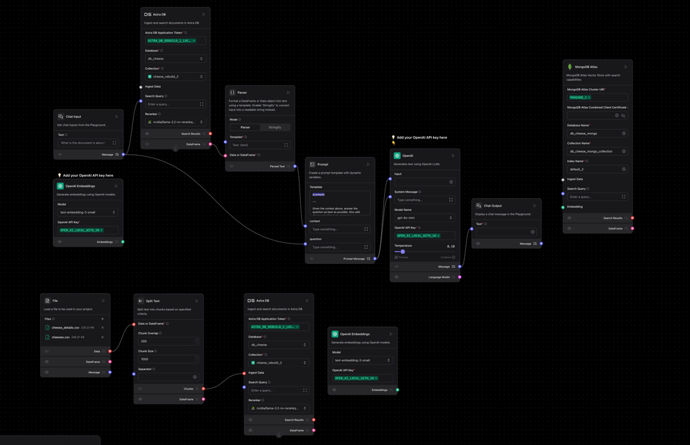

# LangFlow + OpenAI Embeddings + MongoDB Atlas Vector Search Project

This document describes the full setup and configuration of a pipeline that uses LangFlow to:
1. Read and split large text documents into chunks.
2. Generate embeddings using OpenAI’s embedding models.
3. Ingest those embeddings into MongoDB Atlas with a k-NN vector index.
4. Perform semantic (vector) search over the stored embeddings.

I encountered several errors while configuring the LangFlow project. Most issues appeared during the database setup. Every time I tried to start the flow, I would see an error related to connecting to MongoDB Atlas (e.g., “knnVector field is indexed with 384 dimensions but queried with 1536” or “List of Data objects is not supported”). Make sure:  
1. Your MongoDB Atlas URI, database name, and collection name are correct.  
2. The `knnVector` index on the `embedding` field is set to `dimensions: 1536` if you are using OpenAI embeddings (1536-dimensional).  
3. All LangFlow components (especially SplitText, OpenAI Embeddings, and MongoDB Atlas) are up to date and connected properly.  
4. When SplitText produces a list of chunks, use a **For Each** node (or enable “Emit One Chunk At A Time”) so that downstream nodes don’t receive a list instead of a single string.  


    
## Table of Contents

1. [Prerequisites & Environment](#prerequisites--environment)
2. [Step 1: OpenAI API Setup](#step-1-openai-api-setup)
3. [Step 2: Enabling Embedding Models](#step-2-enabling-embedding-models)
4. [Step 3: Configuring MongoDB Atlas Vector Index](#step-3-configuring-mongodb-atlas-vector-index)
5. [Step 4: Building the LangFlow Pipeline](#step-4-building-the-langflow-pipeline)
    1. [4.1. Updating Outdated Components](#41-updating-outdated-components)
    2. [4.2. Splitting Text & Iterating Over Chunks](#42-splitting-text--iterating-over-chunks)
    3. [4.3. Generating Embeddings](#43-generating-embeddings)
    4. [4.4. Ingesting Data into MongoDB Atlas](#44-ingesting-data-into-mongodb-atlas)
    5. [4.5. Running a Vector Search Query](#45-running-a-vector-search-query)
6. [Common Errors & Troubleshooting](#common-errors--troubleshooting)
    1. [Error: `model_not_found` for Embedding Models](#error-model_not_found-for-embedding-models)
    2. [Error: `List of Data objects is not supported`](#error-list-of-data-objects-is-not-supported)
    3. [Error: Indexed with 384 but queried with 1536](#error-indexed-with-384-but-queried-with-1536)
7. [Alternative Embedding Approaches](#alternative-embedding-approaches)
8. [Example Usage & Verification](#example-usage--verification)
9. [References & Useful Links](#references--useful-links)
10. [Author & Contact](#author--contact)

---

## Prerequisites & Environment

Before you begin, ensure you have:

- **An OpenAI account** with a working API key.
- **LangFlow** installed (you can install via `pip install langflow`).
- **MongoDB Atlas cluster** (can be free tier M0/M2/M5 or paid) with permissions to create indexes.
- **Python 3.8+** (for any local testing or alternative embedding scripts).
- Basic familiarity with:
    - Command-line shell (bash/zsh)
    - Python (for optional local embedding alternatives)
    - The concept of vector search (k-NN) in databases

---

## Step 1: OpenAI API Setup

1. **Generate an API Key**
    - Log in to [OpenAI Platform](https://platform.openai.com/account/api-keys).
    - Click **+ Create new secret key** and copy the generated key (begins with `sk-...`).

2. **Export the API Key as an Environment Variable**  
   In your terminal (bash/zsh), set:
   ```bash
   export OPENAI_API_KEY="sk-XXXXXXXXXXXXXXXXXXXXXXXXXXXXXXXX"
